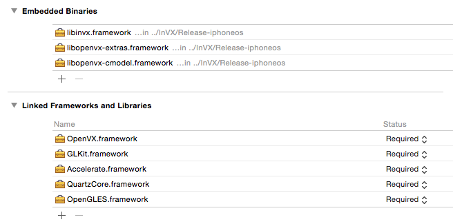
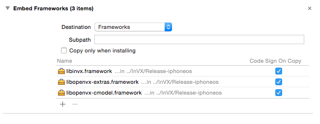
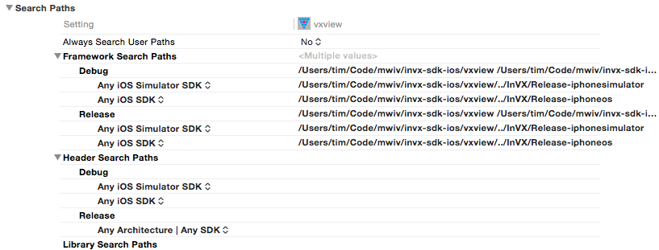

OpenVX for iOS
================

This enables the development of [OpenVX](http://machineswithvision.com/learn-about-openvx/) applications for iOS devices. 

**It was developed from work undertaken in 2015 and is placed here for historic reasons for now and in the public domain.**

The SDK comprises a tailored iOS build of the core OpenVX framework, alongside the default *C*, *extras*, and accelerated *InVX* target backends. Also included is an example OpenVX application: VXView ([the same one as is on the Apple App Store.](https://itunes.apple.com/WebObjects/MZStore.woa/wa/viewSoftware?id=979376440&mt=8)).

This README file is intended to give more specific technical information to aid developers to get this integrated with their own projects.

Lib
----

The '/lib' directory contains the pre-built frameworks for use of the OpenVX SDK. (The intention is to later provide Carthage and/or CocoaPods support for these frameworks as well.)

**NOTE: due to the nature of iOS support for dynamic "embedded" frameworks, only iOS 8.0 or above can be developed for the App Store. Earlier versions of iOS for Ad Hoc deployment are possible.**

To include the core framework in your project - *statically link* the OpenVX.framework by adding it to the "Linked Frameworks and Libraries" list. This provides the main structures, memory management and dynamic loading capabilities of OpenVX.

Following this, include the following as *embedded binaries*:

* `libopenvx-cmodel.framework` - This is a tailored build for iOS of the OpenVX sample implementation "C" target backend. In other-words, it is a complete - **but non-accelerated version** - of OpenVX. 
* `libopenvx-extras.framework` - This is an additional module of functionality provided by the OpenVX sample implementation that provides kernels beyond those in the OpenVX 1.0 specification. For example: Lapacian & Sharr filters, NonMax, etc. These kernels are in fact utilised internally the "C" target, so need to be included to support some operations.
* `libinvx.framework` - **This is the actual accelerated for iOS implementation of InVX**. If you don't include this in your build, you will get a working, but slower version of your App! By including it you will effectively override the "C" kernel implementations with accelerated versions provided by this target backend (and should then see significant performance gain for those kernels).

Note that when you try and drag these in XCode it will probably try to add them to "Linked Frameworks and Libraries" as well. **Don't let it do this - just delete them from this section afterwards!** You should end up with a configuration that looks something like this under the "General" settings of the build (taken from the VxView example project):



You should also check that under the "Build Phases" as a result of adding these, they are included under the "Embed Frameworks" step **where - crucially - the "Destination" is set to "Frameworks"**, like so:



Notice that the OpenVX core framework is structured to follow the convention that the name of the framework precedes any header file (this is different from the conventional OpenVX path of `VX/vx.h`):

```objc
// Notice that for the iOS, the framework name "OpenVX" is referenced!
#import <OpenVX/vx.h>
#import <OpenVX/vxu.h>
```

The frameworks are furthermore separated into *Device* and *Simulator* folders.

* The *Simulator* supports a `i386` and `86_64` build architectures. If you link against these you can run and test your app in development.

* The *Device* supports `arm64`, `armv7`, and  `armv7s` build architectures. If you link against this you can deploy to an actual iOS device - and ultimately can bundle and upload to the App Store.

Note that this can be controlled by separating the Framework Search Paths under "Build Settings" - as shown here by the example vxview app:



Within your code, using the `#import <TargetConditionals.h>` header you can control portions of your code to respond to the build target - as used here by vxview to either set up live video from a device, or use a static image when testing in a simulator:

```objc
#if !(TARGET_IPHONE_SIMULATOR)
    [self setupAVCapture]; // If on real device - will attempt to use camera.
#else
    [self setupStaticImage]; // Otherwise, will just load in test image for simulator.
#endif

```

VXView
------

The '/vxview' directory contains the XCode project for VXView. VXView is an example OpenVX application that captures live video using the camera, processes frames using an OpenVX implementation of the Canny edge operator and then displays the output on screen.

To start in XCode simply select the `vxview.xcodeproj`. 


Issues
------

Very briefly, here are some pointers to issues that people have encountered:

* When running in Simulator the OpenVX code crashes with a NULL vx_context. This is because the context was retuned as NULL due to an inability to load the framework modules caused by the deployed ones being of an unexpected architecture (i.e. not the simulator i386 or x86_64). Despite the search paths being fine for linking, the contents of the bundle for deployment must be configured separately. The solution is to manually delete the embedded "Device" binaries and OpenVX frameworks and re-add (by dragging them) from the "Simulator" folder. Remember you'll have to switch them back again if you want to deploy to a physical iPhone.

